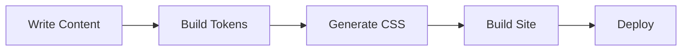

This section covers the markdown features and content authoring tools available in {vars.productName}. Explore the sub-pages for detailed guides on each topic:

- [Code Blocks](./code-blocks/) — Syntax highlighting, title bars, line highlighting, diff lines, and focus lines
- [Tabs](./tabs/) — Pill-style tabbed content with URL query parameter synchronization
- [Admonitions](./admonitions/) — Note, tip, info, caution, danger, and warning callout blocks
- [Headings](./headings/) — Heading anchors with copy-to-clipboard and automatic ID generation
- [MDX and React](./mdx-and-react/) — Using JSX, React components, and custom elements in MDX files

## Tables

| Feature | Status | Description |
|---------|--------|-------------|
| Smart Search | Available | Full-text search with configurable weights |
| Lightbox | Available | Select-to-zoom for images |
| Mermaid | Available | Diagram rendering with pan/zoom |
| FAQ Index | Available | Auto-generated FAQ table of contents |

## Mermaid diagrams

