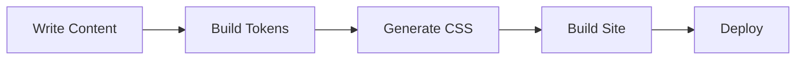

This guide covers the markdown features available in the {vars.productName} docs framework.

## Headings

Use standard markdown headings (`##`, `###`, `####`). Each heading automatically gets an anchor link with a copy-to-clipboard button on hover.

## Code blocks

Fenced code blocks (blocks delimited by triple backticks) support syntax highlighting via [Shiki](https://shiki.style/) with dual light/dark themes. Specify the language after the opening fence:

```javascript
function greet(name) {
  return `Hello, ${name}!`;
}
```

```yaml
apiVersion: backstage.io/v1alpha1
kind: Component
metadata:
  name: my-service
  description: A sample service
spec:
  type: service
  lifecycle: production
  owner: team-platform
```

Every code block includes a **copy button** and a **word wrap toggle** that appear on hover in the top-right corner.

### Title bar

Add a filename or label above a code block with `title="..."` in the meta string:

````md
```ts title="config/site.ts"
export const siteConfig = {
  name: 'My Docs',
}
```
````

```ts title="config/site.ts"
export const siteConfig = {
  name: 'My Docs',
}
```

The title bar appears above the code block with a muted background.

You can combine `title` with other meta features like line highlighting:

````md
```ts title="config/site.ts" {2}
export const siteConfig = {
  name: 'My Docs',  // this line is highlighted
}
```
````

```ts title="config/site.ts" {2}
export const siteConfig = {
  name: 'My Docs',
}
```

### Highlighting lines

Highlight specific lines by adding line numbers in curly braces after the language:

````md
```js {2,4-5}
const a = 1
const b = 2  // highlighted
const c = 3
const d = 4  // highlighted
const e = 5  // highlighted
```
````

```js {2,4-5}
const a = 1
const b = 2
const c = 3
const d = 4
const e = 5
```

### Inline highlight comments

Highlight individual lines using an inline comment. The comment is removed from the rendered output:

````md
```js
const regular = true
const highlighted = true // [!code highlight]
```
````

```js
const regular = true
const highlighted = true // [!code highlight]
```

### Diff lines

Show added and removed lines with `[!code ++]` and `[!code --]`:

````md
```js
const config = {
  theme: 'light', // [!code --]
  theme: 'dark',  // [!code ++]
}
```
````

```js
const config = {
  theme: 'light', // [!code --]
  theme: 'dark',  // [!code ++]
}
```

### Focus lines

Dim all lines except the focused ones. Non-focused lines become visible on hover:

````md
```js
const a = 1
const b = 2 // [!code focus]
const c = 3
```
````

```js
const a = 1
const b = 2 // [!code focus]
const c = 3
```

### Comment syntax by language

The inline notations (`[!code highlight]`, `[!code ++]`, `[!code --]`, `[!code focus]`) use the comment syntax of the code block's language. Here are the most common:

| Language | Comment syntax | Example |
|----------|--------------|---------|
| JavaScript, TypeScript, Java, C, Go | `//` | `// [!code highlight]` |
| Python, Ruby, Bash, YAML | `#` | `# [!code highlight]` |
| HTML, XML, MDX | `<!-- -->` | `<!-- [!code highlight] -->` |
| CSS | `/* */` | `/* [!code highlight] */` |
| SQL | `--` | `-- [!code highlight]` |

For example, highlighting a line in a YAML block:

```yaml
server:
  host: localhost
  port: 8080 # [!code highlight]
```

### Best practices

- **Use `title` for filenames** — When showing config files or code that readers create, add `title="path/to/file"` so they know where to put it.
- **Use meta line numbers for multiple highlights** — `{2,4-5}` is cleaner than adding `[!code highlight]` to every line.
- **Use inline comments for single-line emphasis** — `[!code highlight]` is better when you want to highlight one specific line in a longer block.
- **Use diff notation for before/after** — `[!code ++]` and `[!code --]` are clearer than describing changes in prose.
- **Use focus for teaching** — `[!code focus]` dims everything except the important lines, which is ideal for tutorials where you need to highlight a specific part of a larger snippet.
- **Don't mix meta highlights with inline highlights** — Pick one approach per code block. Using both can produce unexpected results.

## Admonitions

:::note
This is a **note** admonition. Use it for supplementary information.
:::

:::tip
This is a **tip** admonition. Use it for best practices and recommendations.
:::

:::info
This is an **info** admonition. Use it for important context.
:::

:::caution
This is a **caution** admonition. Use it for things that could cause issues.
:::

:::danger
This is a **danger** admonition. Use it for critical warnings.
:::

## Tabs

Use the `<Tabs>` and `<TabItem>` components for tabbed content. Tab state syncs to the URL so tabs are shareable:

`````text
<Tabs>
  <TabItem value="npm" label="npm" default>

    ```bash
    npm install @pixlngrid/trellis
    ```

  </TabItem>
  <TabItem value="yarn" label="yarn">

    ```bash
    yarn add @pixlngrid/trellis
    ```

  </TabItem>
  <TabItem value="pnpm" label="pnpm">

    ```bash
    pnpm add @pixlngrid/trellis
    ```

  </TabItem>
</Tabs>
`````

<Tabs>
  <TabItem value="npm" label="npm" default>

```bash
npm install @pixlngrid/trellis
```

  </TabItem>
  <TabItem value="yarn" label="yarn">

```bash
yarn add @pixlngrid/trellis
```

  </TabItem>
  <TabItem value="pnpm" label="pnpm">

```bash
pnpm add @pixlngrid/trellis
```

  </TabItem>
</Tabs>

## Tables

| Feature | Status | Description |
|---------|--------|-------------|
| Smart Search | Available | Full-text search with configurable weights |
| Lightbox | Available | Select-to-zoom for images |
| Mermaid | Available | Diagram rendering with pan/zoom |
| FAQ Index | Available | Auto-generated FAQ table of contents |

## Mermaid diagrams



## Details/Collapsible

<details>
  <summary>Select to expand</summary>

  This content is hidden by default and shown when you select the summary.

  You can include any markdown content here, including:
  - Lists
  - Code blocks
  - Images

</details>

## Raw HTML in MDX

MDX compiles to JSX, not plain HTML. That means any raw HTML you write inside an `.mdx` file must follow JSX rules — not HTML rules. The most common mistake is using HTML attribute names that React doesn't recognize.

### Use `className`, not `class`

HTML's `class` attribute becomes `className` in JSX. Using `class` causes a runtime error:

```mdx
{/* ❌ Breaks at runtime */}
<div class="my-layout">...</div>

{/* ✅ Correct */}
<div className="my-layout">...</div>
```

:::danger
Using `class=` in MDX produces an **"Invalid DOM property `class`. Did you mean `className`?"** console error and may break the page render.
:::

### Other HTML → JSX attribute changes

| HTML attribute | JSX equivalent | Notes |
|----------------|---------------|-------|
| `class` | `className` | Most common mistake |
| `for` | `htmlFor` | Used on `<label>` elements |
| `style="color:red"` | `style={{ color: 'red' }}` | Inline styles must be objects |
| `<br>` | `<br />` | All void elements must be self-closing |
| `tabindex` | `tabIndex` | React uses camelCase for most attributes |

### Avoid Docusaurus-specific markup

If you're migrating content from Docusaurus, watch for Infima CSS classes (`col--6`, `card__header`, `container-fluid`, etc.). These classes don't exist in Trellis — replace them with Tailwind equivalents using `className`:

```mdx
{/* ❌ Docusaurus Infima — won't work in Trellis */}
<div class="row">
  <div class="col col--6">...</div>
</div>

{/* ✅ Tailwind equivalent */}
<div className="grid grid-cols-2 gap-6">
  <div>...</div>
</div>
```

See the [Migrating from Docusaurus](/guides/migrating-from-docusaurus/) guide for a full reference.