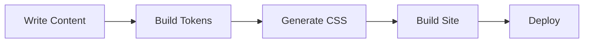

This guide covers the markdown features available in the {vars.productName} docs framework.

## Headings

Use standard markdown headings (`##`, `###`, `####`). Each heading automatically gets an anchor link with a copy-to-clipboard button on hover.

## Code Blocks

Fenced code blocks support syntax highlighting via [Shiki](https://shiki.style/) with dual light/dark themes. Just specify the language after the opening fence:

```javascript
function greet(name) {
  return `Hello, ${name}!`;
}
```

```yaml
apiVersion: backstage.io/v1alpha1
kind: Component
metadata:
  name: my-service
  description: A sample service
spec:
  type: service
  lifecycle: production
  owner: team-platform
```

Every code block includes a **copy button** that appears on hover in the top-right corner.

### Highlighting Lines

You can highlight specific lines by adding line numbers in curly braces after the language:

````md
```js {2,4-5}
const a = 1
const b = 2  // highlighted
const c = 3
const d = 4  // highlighted
const e = 5  // highlighted
```
````

```js {2,4-5}
const a = 1
const b = 2
const c = 3
const d = 4
const e = 5
```

### Inline Highlight Comments

You can highlight individual lines using an inline comment. The comment is removed from the rendered output:

````md
```js
const regular = true
const highlighted = true // [!code highlight]
```
````

```js
const regular = true
const highlighted = true // [!code highlight]
```

### Diff Lines

Show added and removed lines with `[!code ++]` and `[!code --]`:

````md
```js
const config = {
  theme: 'light', // [!code --]
  theme: 'dark',  // [!code ++]
}
```
````

```js
const config = {
  theme: 'light', // [!code --]
  theme: 'dark',  // [!code ++]
}
```

### Focus Lines

Dim all lines except the focused ones. Non-focused lines become visible on hover:

````md
```js
const a = 1
const b = 2 // [!code focus]
const c = 3
```
````

```js
const a = 1
const b = 2 // [!code focus]
const c = 3
```

## Admonitions

:::note
This is a **note** admonition. Use it for supplementary information.
:::

:::tip
This is a **tip** admonition. Use it for best practices and recommendations.
:::

:::info
This is an **info** admonition. Use it for important context.
:::

:::caution
This is a **caution** admonition. Use it for things that could cause issues.
:::

:::danger
This is a **danger** admonition. Use it for critical warnings.
:::

## Tabs

Use the `<Tabs>` and `<TabItem>` components for tabbed content. Tab state syncs to the URL so tabs are shareable:

<Tabs>
  <TabItem value="npm" label="npm" default>

```bash
npm install @pixlngrid/trellis
```

  </TabItem>
  <TabItem value="yarn" label="yarn">

```bash
yarn add @pixlngrid/trellis
```

  </TabItem>
  <TabItem value="pnpm" label="pnpm">

```bash
pnpm add @pixlngrid/trellis
```

  </TabItem>
</Tabs>

## Tables

| Feature | Status | Description |
|---------|--------|-------------|
| Smart Search | Available | Full-text search with configurable weights |
| Lightbox | Available | Click-to-zoom for images |
| Mermaid | Available | Diagram rendering with pan/zoom |
| FAQ Index | Available | Auto-generated FAQ table of contents |

## Mermaid Diagrams



## Details/Collapsible

<details>
  <summary>Click to expand</summary>

  This content is hidden by default and shown when the user clicks the summary.

  You can include any markdown content here, including:
  - Lists
  - Code blocks
  - Images

</details>
