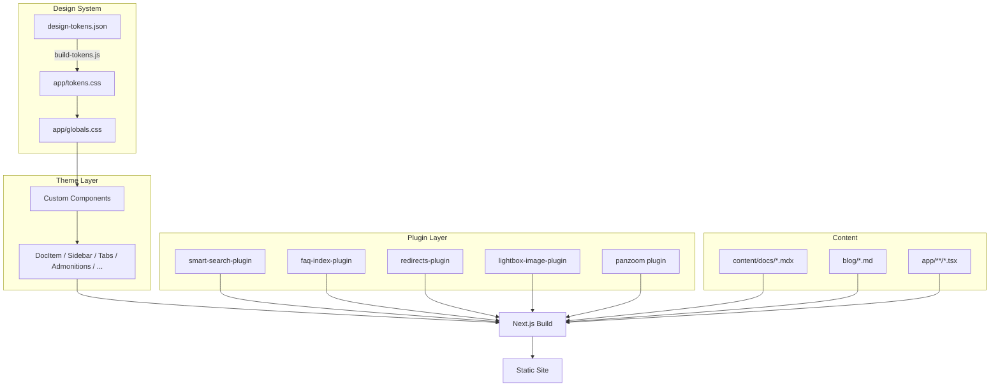

Trellis extends the standard Next.js architecture with three layers: a design token pipeline, custom theme components, and bundled plugins.

## Build Pipeline



## Design Token Pipeline

The token pipeline converts a single JSON file into CSS custom properties that the entire theme consumes.

```
design-tokens.json  →  scripts/build-tokens.js  →  app/tokens.css
```

**How it works:**

1. `design-tokens.json` defines colors, spacing, border radii, and typography as nested objects with `value` and `type` properties
2. `scripts/build-tokens.js` recursively traverses the JSON and generates a `:root {}` block with CSS custom properties
3. The output lands in `app/tokens.css`, which is imported in `app/globals.css`
4. `globals.css` maps these tokens to CSS variables (e.g., `--ifm-color-primary`)

This means you change colors in one place (`design-tokens.json`) and they propagate everywhere.

## Theme Layer

Trellis uses custom theme components that provide complete control over rendering and layout.

### Directory Structure

```
components/docs/
├── Admonition/           # Custom SVG icons + layout
│   ├── Icon/             # Note, Tip, Info, Caution, Danger icons
│   ├── Layout/
│   └── Type/
├── DocItem/
│   ├── Content/          # Last-updated at top, "Suggest Edit" link
│   ├── Footer/
│   ├── Layout/
│   ├── Metadata/
│   ├── Paginator/
│   └── TOC/
├── DocRoot/              # Main layout + sidebar
├── DocSidebar/           # Desktop + mobile sidebar
├── DocSidebarItem/       # Category, link, HTML items
├── Tabs/                 # Pill-style tabs with URL sync
├── Details/              # Collapsible sections
├── Footer/               # Site footer
├── EditThisPage/         # Custom pencil icon
├── NotFound/             # 404 page
└── ...                   # ~107 total components
```

### Key Modifications

| Component | What changed |
|-----------|-------------|
| `DocItem/Content` | Last-updated row rendered at page **top** instead of bottom. Added "Suggest an Edit" link that opens a pre-filled GitHub issue |
| `Tabs` | Tab selection synced to URL query parameters. Pill-style CSS with accent colors |
| `Admonition/Icon/*` | Each admonition type (note, tip, info, caution, danger) uses a custom SVG icon instead of the default |
| `EditThisPage` | Uses a custom inline SVG pencil icon instead of the default |
| `Details` | Styled with brand and accent token colors |

## Plugin Layer

Trellis bundles five plugins that hook into different parts of the build lifecycle:

| Plugin | Lifecycle Hook | Purpose |
|--------|---------------|---------|
| `smart-search-plugin` | `postBuild` | Indexes all docs at build time, generates `searchIndex.json` for client-side Fuse.js search |
| `faq-index-plugin` | `loadContent` + `contentLoaded` | Scans FAQ directory for `###` headings, exposes data via `setGlobalData` |
| `redirects-plugin` | `postBuild` | Reads `redirects.json`, generates HTML files with meta-refresh redirects |
| `lightbox-image-plugin` | Client-side | Adds click-to-zoom to all `.markdown img` elements |
| Mermaid pan/zoom | Client-side | Enables pan and zoom on Mermaid diagrams and other supported elements |

## Project Structure

```
trellis/
├── design-tokens.json        # Brand colors, spacing, typography
├── config/site.ts            # Site configuration + plugin registration
├── config/sidebar.ts         # Sidebar navigation structure
├── redirects.json             # URL redirect definitions
├── scripts/
│   └── build-tokens.js       # Token → CSS converter
├── content/docs/             # Documentation content (MDX)
├── blog/                     # Blog/release notes (Markdown)
├── app/
│   ├── tokens.css            # Generated — do not edit
│   └── globals.css           # Theme overrides using token variables
├── components/
│   ├── docs/                 # Theme components
│   ├── custom/               # Reusable React components
│   └── data/                 # JSON data files (glossary, etc.)
├── public/                   # Static assets (images, search index)
└── packages/
    ├── faq-index-plugin/     # FAQ indexing plugin
    └── redirects-plugin/     # Redirect management plugin
```
