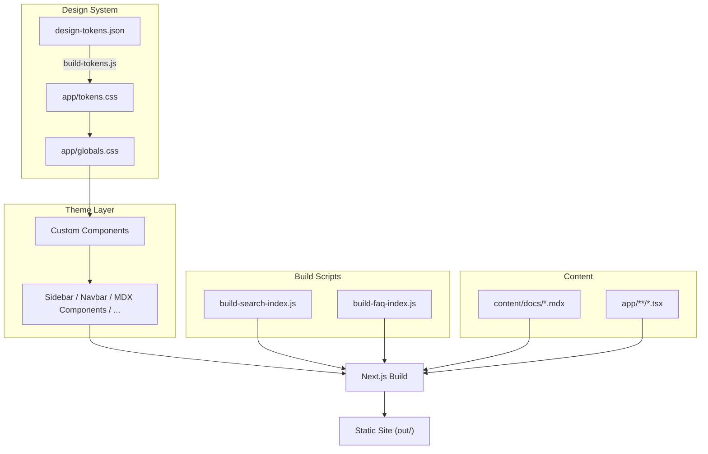

{vars.productName} extends the standard {vars.frameworkName} architecture with three layers: a design token pipeline, custom theme components, and bundled plugins.

## Build Pipeline



## Design Token Pipeline

The token pipeline converts a single JSON file into CSS custom properties that the entire theme consumes.

```
design-tokens.json  →  scripts/build-tokens.js  →  app/tokens.css
```

**How it works:**

1. `design-tokens.json` defines colors, spacing, border radii, and typography as nested objects with `value` and `type` properties
2. `scripts/build-tokens.js` recursively traverses the JSON and generates a `:root {}` block with CSS custom properties
3. The output lands in `app/tokens.css`, which is imported in `app/globals.css`
4. `globals.css` maps these tokens to semantic CSS variables (e.g., `--primary`, `--muted`)

This means you change colors in one place (`design-tokens.json`) and they propagate everywhere.

## Theme Layer

{vars.productName} uses custom theme components that provide complete control over rendering and layout.

### Directory Structure

```
components/docs/
├── mdx/
│   ├── index.tsx            # MDX component registry
│   ├── callout.tsx          # Admonitions (note, tip, info, caution, danger) with custom SVG icons
│   ├── code-block.tsx       # Shiki syntax highlighting (server component)
│   ├── code-block-client.tsx # Copy button + word wrap toggle (client component)
│   ├── heading.tsx          # Heading anchors with copy-to-clipboard
│   ├── tabs.tsx             # Pill-style tabs with URL sync
│   ├── image-lightbox.tsx   # Click-to-zoom image modal
│   └── mermaid.tsx          # Mermaid diagram renderer with pan/zoom
├── search/
│   └── search-dialog.tsx    # Cmd+K search modal (Fuse.js)
├── navbar.tsx               # Top navbar + mobile sidebar drawer
├── sidebar.tsx              # Desktop sidebar with collapsible categories
├── breadcrumbs.tsx          # Breadcrumb navigation
├── toc.tsx                  # Table of contents (right sidebar)
└── footer.tsx               # Site footer
```

### Key Components

| Component | What it does |
|-----------|-------------|
| `callout.tsx` | Each admonition type (note, tip, info, caution, danger) has a custom SVG icon and styled container |
| `tabs.tsx` | Tab selection synced to URL query parameters; pill-style CSS with accent colors |
| `heading.tsx` | Heading anchors with click-to-copy URL functionality |
| `code-block.tsx` | Shiki dual-theme syntax highlighting with line highlighting, diffs, and focus |
| `code-block-client.tsx` | Copy button and word wrap toggle for code blocks |

## Build Scripts & Features

{vars.productName} uses pre-build scripts and client-side components for additional functionality:

| Script / Component | Runs | Purpose |
|---------------------|------|---------|
| `build-search-index.js` | Pre-build | Indexes all docs, generates `public/searchIndex.json` for client-side Fuse.js search |
| `build-faq-index.js` | Pre-build | Scans FAQ directory for `###` headings, generates `public/faqIndex.json` |
| `build-tokens.js` | Pre-build | Converts `design-tokens.json` into `app/tokens.css` |
| `image-lightbox.tsx` | Client-side | Click-to-zoom modal for images in MDX content |
| `mermaid.tsx` | Client-side | Mermaid diagram renderer with pan and zoom support |

## Project Structure

```
trellis/  
├── design-tokens.json        # Brand colors, spacing, typography
├── config/
│   ├── site.ts               # Site configuration (metadata, search, color mode)
│   └── sidebar.ts            # Sidebar navigation structure
├── redirects.json            # URL redirect definitions
├── scripts/
│   ├── build-tokens.js       # Token → CSS converter
│   ├── build-search-index.js # Search index generator
│   └── build-faq-index.js    # FAQ index generator
├── content/
│   ├── docs/                 # Documentation content (MDX)
│   ├── blog/                 # Blog posts
│   └── release-notes/        # Release notes
├── app/
│   ├── (docs)/[...slug]/     # Doc page route (dynamic)
│   ├── blog/                 # Blog page route
│   ├── release-notes/        # Release notes route
│   ├── tokens.css            # Generated — do not edit
│   ├── globals.css           # Theme + Shiki styles using token variables
│   └── layout.tsx            # Root layout with providers
├── components/
│   ├── docs/                 # Theme components (sidebar, navbar, MDX, etc.)
│   ├── brand/                # Brand assets (logo SVGs)
│   └── custom/               # Reusable React components
├── lib/                      # Utilities (content loader, TOC extractor, etc.)
├── public/                   # Static assets (images, searchIndex.json)
└── packages/
    └── create-trellis-docs/  # CLI scaffolder (npx create-trellis-docs)
```
