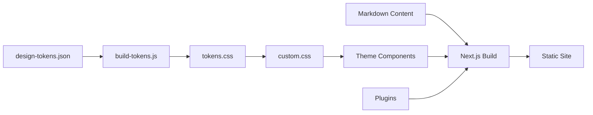

Trellis is a documentation framework built on [Next.js](https://nextjs.org/) that adds theme enhancements, a design token system, bundled plugins, and reusable components — so you can focus on writing content instead of configuring tooling.

## Why Trellis?

Next.js is a powerful React framework, but setting up a polished documentation site still requires significant customization: building theme components, configuring search, adding image zoom, managing redirects, and aligning your design system. Trellis does this work upfront so every project starts with a consistent, production-ready baseline.

## What's Included

| Category | What you get |
|----------|-------------|
| **Theme** | Custom components with UX improvements — last-updated at page top, heading copy-to-clipboard, tab URL sync, custom admonition icons, pill-style tabs |
| **Design Tokens** | JSON-to-CSS pipeline that converts `design-tokens.json` into CSS custom properties at build time |
| **Smart Search** | Build-time indexing with Fuse.js for fast, client-side fuzzy search with configurable field weights |
| **Image Lightbox** | Click-to-zoom on any markdown image — no extra markup needed |
| **Mermaid Diagrams** | Built-in Mermaid rendering with pan and zoom support |
| **FAQ Indexer** | Auto-generates a searchable FAQ table of contents from `###` headings in your FAQ pages |
| **Redirects** | Manages URL redirects via a JSON file — generates HTML meta-refresh pages at build time |
| **Components** | Reusable React components: Glossary, Feedback widget, Flipping cards, Custom search UI |

## Who Is It For?

- **Technical writers** who want a polished docs site without front-end configuration
- **Platform teams** building internal developer portals
- **Open-source projects** that need more than a vanilla docs setup out of the box
- **Anyone** who wants to start writing docs, not configuring build tools

## How It Works

The build pipeline:
1. **Design tokens** are defined in `design-tokens.json` and converted to CSS custom properties
2. **Theme components** consume those tokens through CSS variables
3. **Plugins** (search, FAQ index, redirects, lightbox) hook into the build lifecycle
4. **Next.js** compiles everything into a static site

## Next Steps

- [Trellis vs Next.js](/overview/trellis-vs-docusaurus/) — see exactly what Trellis adds
- [Architecture](/overview/architecture/) — understand how the pieces fit together
- [Getting Started](/getting-started/) — set up a new project
