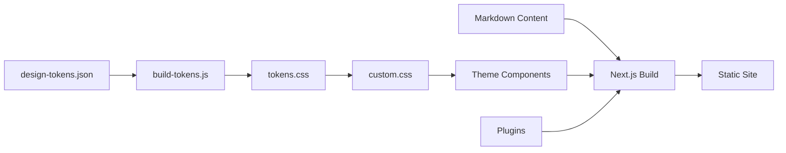

{vars.productName} is a documentation framework built on [{vars.frameworkName}](https://nextjs.org/) that adds theme enhancements, a design token system, bundled plugins, and reusable components — so you can focus on writing content instead of configuring tooling.

## Why {vars.productName}?

{vars.frameworkName} is a powerful React framework, but setting up a polished documentation site requires significant customization: building theme components, configuring search, adding image zoom, managing redirects, and aligning your design system. {vars.productName} does this work upfront so every project starts with a consistent, production-ready baseline.

- **Variables in content** — Define product names, versions, and terms once. Use them on every page. Rename a product? Change one file.
- **Your components, your way** — Drop in React components per-page or register them globally. No swizzling, no ejecting, no magic.
- **Own your output** — Static HTML export. Deploy to any host. No vendor lock-in, no runtime server, no SaaS subscription.
- **Content audit built in** — Export your entire doc inventory as a CSV — title, URL, doc type, owner, draft status, last updated. The only docs framework with this built in.
- **Built by a writer, not a framework team** — Every default reflects 30 years of documentation experience. Last-updated dates at the top, not buried. Heading anchors that copy on click. Search that works without Algolia.

## What's included

| Category | What you get |
|----------|-------------|
| **Theme** | Custom components with UX improvements — last-updated at page top, heading copy-to-clipboard, tab URL sync, custom admonition icons, pill-style tabs |
| **Design Tokens** | JSON-to-CSS pipeline that converts `design-tokens.json` into CSS custom properties at build time |
| **Smart Search** | Build-time indexing with Fuse.js for fast, client-side fuzzy search with configurable field weights |
| **Image Lightbox** | Click-to-zoom on any markdown image — no extra markup needed |
| **Mermaid Diagrams** | Built-in Mermaid rendering with pan and zoom support |
| **FAQ Indexer** | Auto-generates a searchable FAQ table of contents from `###` headings in your FAQ pages |
| **Redirects** | Manages URL redirects via a JSON file — generates HTML meta-refresh pages at build time |
| **Components** | Reusable React components: Glossary, Feedback widget, Flipping cards, Custom search UI |
| **Content Audit Export** | Export your full doc inventory as a CSV — title, URL, doc type, owner, draft status, last updated. Run `npm run export:sidebar` at any time |

## Framework comparison

How {vars.productName} stacks up against the most popular docs-as-code frameworks.

| Feature | Trellis | Docusaurus | Nextra | Starlight | GitBook |
|---------|:-------:|:----------:|:------:|:---------:|:-------:|
| Static export | <Check /> | <Check /> | <Check /> | <Check /> | <Cross /> |
| MDX support | <Check /> | <Check /> | <Check /> | <Check /> | <Cross /> |
| Reusable variables in content | <Check /> | <Cross /> | <Cross /> | <Cross /> | <Check /> |
| Custom components in content | <Check /> | <Check /> | <Check /> | <Check /> | <Cross /> |
| Built-in search (no Algolia) | <Check /> | <Cross /> | <Check /> | <Check /> | <Check /> |
| Design token pipeline | <Check /> | <Cross /> | <Cross /> | <Partial /> | <Cross /> |
| Dark mode out of the box | <Check /> | <Check /> | <Check /> | <Check /> | <Check /> |
| Self-hosted / deploy anywhere | <Check /> | <Check /> | <Check /> | <Check /> | <Cross /> |
| CLI scaffolding | <Check /> | <Check /> | <Partial /> | <Check /> | <Cross /> |
| TypeScript config | <Check /> | <Check /> | <Check /> | <Check /> | <Cross /> |
| Blog support | <Check /> | <Check /> | <Check /> | <Partial /> | <Cross /> |
| i18n / localization | <Check /> | <Check /> | <Partial /> | <Check /> | <Partial /> |
| Documentation versioning | <Check /> | <Check /> | <Cross /> | <Partial /> | <Partial /> |
| Audience role tagging | <Check /> | <Cross /> | <Cross /> | <Cross /> | <Cross /> |
| Content audit export | <Check /> | <Cross /> | <Cross /> | <Cross /> | <Partial /> |
| Free & open source | <Check /> | <Check /> | <Check /> | <Check /> | <Cross /> |

<Check /> = included &nbsp; <Partial /> = partial / plugin required &nbsp; <Cross /> = not available

## Tech stack

| Layer | Technology |
|-------|-----------|
| Framework | Next.js 15 |
| Styling | Tailwind CSS v4 |
| Components | shadcn/ui |
| MDX | next-mdx-remote v5 |
| Search | Fuse.js |
| Syntax | Shiki |
| Diagrams | Mermaid |
| Output | Static HTML |

## Who is it for?

- **Technical writers** who want a polished docs site without front-end configuration
- **Platform teams** building internal developer portals
- **Open-source projects** that need more than a vanilla docs setup out of the box
- **Anyone** who wants to start writing docs, not configuring build tools

## How it works

The build pipeline:
1. **Design tokens** are defined in `design-tokens.json` and converted to CSS custom properties.
2. **Theme components** consume those tokens through CSS variables.
3. **Plugins** (search, FAQ index, redirects, lightbox) hook into the build lifecycle.
4. **Next.js** compiles everything into a static site.

## Who built it

{vars.productName} was created by **Patricia McPhee**, a technical writer with 30 years in tech. She has documented APIs, SDKs, and developer platforms at Microsoft, Amazon, Facebook/Oculus, GE Healthcare, LivePerson, Beyond Identity, and Expedia Group. Her specialties are developer documentation, docs-as-code workflows, and information architecture.

{vars.productName} exists because every docs framework she used was missing something. Docusaurus doesn't support reusable variables. Nextra has no design token system. Starlight is tied to Astro. GitBook locks you into a paid platform. {vars.productName} combines the best ideas from all of them into a single, self-hosted framework built on {vars.frameworkName} — the React framework most teams already know.

## Next steps

- [{vars.productName} vs {vars.frameworkName}](/overview/trellis-vs-nextjs/) — see exactly what {vars.productName} adds
- [Architecture](/overview/architecture/) — understand how the pieces fit together
- [Getting Started](/getting-started/) — set up a new project
- [Migrating from Docusaurus](/guides/migrating-from-docusaurus/) — move an existing Docusaurus site to {vars.productName}