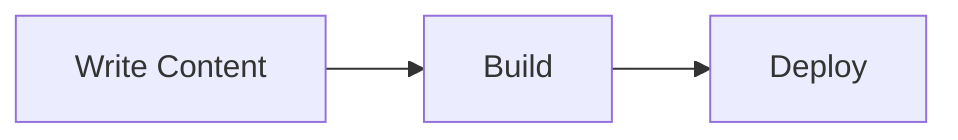

This guide covers the markdown features available in your Trellis documentation site.

## Headings

Use standard markdown headings (`##`, `###`, `####`). Each heading automatically gets an anchor link with a copy-to-clipboard button on hover.

## Code Blocks

Fenced code blocks support syntax highlighting via Prism:

```javascript title="example.js"
function greet(name) {
  return `Hello, ${name}!`;
}
```

## Admonitions

:::note
This is a **note** admonition. Use it for supplementary information.
:::

:::tip
This is a **tip** admonition. Use it for best practices.
:::

:::info
This is an **info** admonition. Use it for important context.
:::

:::caution
This is a **caution** admonition. Use it for things that could cause issues.
:::

:::danger
This is a **danger** admonition. Use it for critical warnings.
:::

## Tabs

import Tabs from '@theme/Tabs';
import TabItem from '@theme/TabItem';

<Tabs>
  <TabItem value="npm" label="npm" default>

```bash
npm install
```

  </TabItem>
  <TabItem value="yarn" label="yarn">

```bash
yarn install
```

  </TabItem>
</Tabs>

## Tables

| Feature | Status |
|---------|--------|
| Smart Search | Available |
| Image Lightbox | Available |
| Mermaid Diagrams | Available |

## Mermaid Diagrams



## Collapsible Sections

<details>
  <summary>Click to expand</summary>

  This content is hidden by default.

</details>
